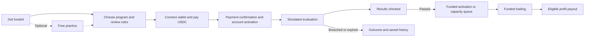

# Props.trade — complete screen plan

23 September 2026 · Planning deliverable · Responsive web · Final visual exports: 4K

## 1. Product experience

A light, compact workspace built around a clear progression: choose an evaluation, pay in USDC, trade a simulated account, pass the rules, activate funded capital, trade on GMTrade and request eligible profits. Keep the terminal familiar throughout. Account stage, risk and execution status carry the important differences.

The plan covers **21 core screen designs**, **one optional free-practice design** and **three later capital-provider designs**. Some share a route or appear as focused overlays; this is design coverage, not a requirement for 25 separate pages.

The shared product conversation, Strat research and GMTrade documentation inform this plan. Commercial rules and the proposed onchain architecture still need validation. [PRODUCT.md](PRODUCT.md) records those boundaries; [RESEARCH.md](RESEARCH.md) links the evidence.

## 2. Stages and journey

| Stage | Purpose | Execution and capital | Persistent label and metrics |
|---|---|---|---|
| Practice — optional | Learn before purchasing. | Virtual balance and simulated orders; no qualification or payout. | Practice · Simulated. Clear route to evaluation. |
| Evaluation | Qualify under purchased rules. | Simulated positions; evaluation fee paid in USDC. | Evaluation · Simulated. Target, loss allowance and applicable deadline. |
| Funded | Trade an approved allocation. | Proposed real GMTrade positions using Props.trade vault margin. | Funded · Live. Allocation, loss allowance and eligible settled profit. |

Free practice is a recommendation, not a confirmed Props.trade requirement or a verified separate Strat feature. The paid simulated evaluation is the working model from the brief.



An apparent target hit does not itself establish a pass: reconcile applicable positions, costs, time conditions and rules first. Passing and funded activation are separate when capital or a transaction is pending. The account lifecycle after payout remains an open decision.

## 3. Navigation

**Trade · Accounts · Payouts · Verify** form the primary navigation. Markets is accessible through the terminal's searchable picker and a compact directory link. Get funded is prominent before account activation and remains available from Accounts. Verify includes public vault transparency.

The header keeps account identity, stage and wallet/session state visible. Preferences and help sit in the account menu. Returning users resume their last valid account and market. Account switching rebinds positions, risk and pending actions together; an order prepared for one account must never silently submit against another.

## 4. Complete screen inventory

### Onboarding and funding

| ID | Design / proposed route | Contents | Action and essential states |
|---|---|---|---|
| 01 | **Get funded** · `/get-funded` | Concise explanation, evaluation-to-funded journey, program choices, fee and loss-rule summary; optional practice entry. | Choose program. Loading, available, unavailable and returning-account states. Capacity figures require real data. |
| 02 | **Program and rules** · `/get-funded/:program` | Account-size definition, complete cost, target formula, drawdown basis, markets, leverage, time rules, payout split and terms version. | Continue. Failed rule loading blocks purchase. Decisive limits remain visible. |
| 03 | **Wallet onboarding** · focused overlay | Supported Solana connection, session/network, USDC balance and applicable transaction-cost requirements. | Connect/retry. Missing wallet, rejection, wrong network, insufficient USDC or SOL where required. |
| 04 | **USDC checkout** · `/checkout/:program` | Program, exact payment breakdown, recipient, applicable terms and simulated-evaluation explanation. | Pay displayed amount. Changed terms/price require review; rejected signatures preserve the selection. |
| 05 | **Payment and activation** · `/checkout/:id/status` | Submission, confirmation, account creation and readiness as separate steps, with transaction evidence. | Open evaluation. Pending, provisioning, ready, failed, expired and uncertain. Reconcile before offering another payment. |

### Accounts and evaluation

| ID | Design / proposed route | Contents | Action and essential states |
|---|---|---|---|
| 06 | **My accounts** · `/accounts` | Active and past accounts, stage, status, equity/virtual balance, loss allowance and target progress where applicable. | Resume/start. Empty, one-account and history layouts; concurrent accounts remain a business decision. |
| 07 | **Evaluation overview** · `/accounts/:id` | Qualifying profit, target, equity curve, drawdown allowance, time/trade requirements, rules version and simulated activity. | Continue trading. Fresh, active, near limit and result-checking states. |
| 08 | **Evaluation terminal** · `/trade/:account/:market` | Complete chart and order workspace, simulated positions, target progress and risk strip. Evaluation gains explicitly non-withdrawable. | Simulate order. Empty/active positions, triggers, restrictions and near-limit states. |
| 09 | **Evaluation result** · `/accounts/:id/result` | Passed/breached/expired result, reason, metrics and thresholds, timeline and history. Explain what changes when funded. | Activate funding or review history/restart when allowed. Include results still being checked. |
| 10 | **Funded activation** · `/accounts/:id/activate` | Assigned allocation, changed rules, trading permissions, account address, available capital and any required authorization. | Activate/open funded account. Awaiting capacity, ready, submitting, confirmed and failed. ETA only when known. |

### Funded trading and review

| ID | Design / proposed route | Contents | Action and essential states |
|---|---|---|---|
| 11 | **Funded overview** · `/accounts/:id` | Margin allocation, buying power, equity, loss allowance, realized/unrealized P&L, eligible profit, recent activity and account evidence. | Trade/view payouts. Active, near limit, restricted, closure pending and closed. Remove evaluation-only metrics. |
| 12 | **Funded terminal** · `/trade/:account/:market` | Shared terminal with real execution, costs, position/order status, account limits and evidence links. | Submit/manage order. Awaiting execution, rejected/frozen, stale, reconnecting and restricted states. |
| 13 | **Markets** · `/markets` | Search, watchlist, categories, perpetual-contract identity, prices, sessions and meaningful liquidity/capacity data. | Open market. No matches, unavailable market and session-dependent conditions. Actual markets come from supported configuration. |
| 14 | **Performance** · `/accounts/:id/performance` | Net equity/P&L, period filters, realized/unrealized breakdown, fees, funding/borrowing and useful trading statistics. | Inspect period/trade. Empty, first trade, unavailable data and archived account. Label return denominators; separate stages. |
| 15 | **Activity** · `/accounts/:id/activity` | Orders, executions, cancellations, charges, account events and payouts with filters and detail drawers. | Inspect record/source. Pending, confirmed, failed and indexing. Simulated entries have no misleading transaction links. |

### Payouts, evidence and preferences

| ID | Design / proposed route | Contents | Action and essential states |
|---|---|---|---|
| 16 | **Payout overview** · `/payouts` | Settled eligible profit, trader share, deductions, requirements and request history. Principal stays distinct from proceeds. | Request payout. No profit, unsettled, minimum not met, restricted, existing request and eligible. |
| 17 | **Payout review** · `/payouts/new` | Gross eligible profit, configured split, fees/conversion, net USDC, destination and effect on account/limits. | Confirm. Eligibility changed, destination error, signature rejection and pending request. Account-continuation policy still needs a decision. |
| 18 | **Payout receipt/status** · `/payouts/:id` | Request, settlement and transfer timeline; expected/actual amount; recipient and evidence. | Inspect proof/return. Processing, delayed, paid, failed and uncertain. Submission is not payment completion. |
| 19 | **Verify records** · `/verify` and `/verify/:record` | Supported account/transaction search, rule references, authority, trade and payout evidence with timestamps and source links. | Inspect claim. Confirmed, pending, indexing, unsupported and not found. Explain exactly what the evidence establishes. |
| 20 | **Vault transparency** · `/verify/vault` | Props.trade vault address, available/allocated capital, observable obligations, flows and freshness. Explain the separate role of GMTrade liquidity. | Inspect records. Stale/unavailable and initial seed-capital states. No invented yield or public deposit controls. |
| 21 | **Preferences and sessions** · `/settings` | Wallet/session, supported revocation controls, notifications, density, chart preferences, reduced motion and keyboard help. | Save/disconnect/revoke where supported. Contextual help is also available throughout the app. |

### Optional and later designs

| ID | Design | Scope |
|---|---|---|
| 22 | **Free practice terminal** · `/practice/:market` | Optional first release. Virtual balance, simulated orders, reset practice and start evaluation. Reset never affects a paid account. |
| 23 | **Capital-provider overview** · `/vault` | Later. Shares/balance, vault performance, allocation, available liquidity and investment terms. |
| 24 | **Deposit and receipt** · `/vault/deposit` | Later. USDC amount, share calculation, costs, transaction and issuance states. |
| 25 | **Withdrawal and status** · `/vault/withdraw` | Later. Available amount, any queue/window, settlement and claim under the eventual vault rules. |

Leaderboards, referrals, points, self-funded retail trading and operator administration are outside the initial trader scope. LP screens require a separate definition of valuation, losses, liquidity and withdrawal terms.

## 5. Terminal composition

Design the terminal first to establish density and shared components. Traders should see the market, prepare an order and understand remaining loss allowance without leaving the workspace.

```text
┌─────────────────────────────────────────────────────────────────────────┐
│ Props.trade   Trade  Accounts  Payouts  Verify       Account · Wallet     │
├─────────────────────────────────────────────────────────────────────────┤
│ Evaluation · Simulated  |  Equity  |  Loss allowance  |  Target / status  │
├──────────────────────────────────────────────┬──────────────────────────┤
│ Market · price · session · rates             │ Long / Short             │
├───────────────────────────────┬──────────────┤ Market / Limit / Trigger │
│                               │ Recent trades│                          │
│             Chart             │      /       │ Size · Leverage          │
│                               │ Liquidity    │ TP / SL                  │
│                               │              │ Costs and risk impact    │
│                               │              │ Submit order             │
├───────────────────────────────┴──────────────┤                          │
│ Positions · Orders · Fills · Account activity│ Account capacity         │
├──────────────────────────────────────────────┴──────────────────────────┤
│ Data freshness · execution connection · transaction status               │
└─────────────────────────────────────────────────────────────────────────┘
```

**Account strip:** stage, status, equity and remaining loss allowance, with amount and applicable percentage. Evaluation adds qualifying target/time metrics; funded substitutes allocation and eligible profit. Put formulas in a nearby rules drawer. Buying power, margin and loss allowance must have distinct labels.

**Market and chart:** clear contract identity, session, price/change and relevant rates/capacity. Keep the chart the largest area, with restrained controls and position/protection markers. Show the last trustworthy timestamp when data becomes stale.

**Recent trades / liquidity:** GMTrade uses liquidity pools. Use actual executions, side capacity and price-impact information where supplied. A conventional order book would misrepresent this model. Collapse this panel before sacrificing the chart or ticket on a laptop.

**Order ticket:** side, supported order type, size units, leverage, notional/margin estimate, optional protections, slippage/acceptable-price settings and costs. Effective limits come from both program and venue. Recalculate the preview when account, size or relevant conditions change.

**Execution feedback:** use specific action labels with simulated/live context. Prevent duplicate submissions during reconciliation. A submitted transaction can still await keeper execution. Preserve intent after a failure while explaining whether retry is safe.

**Position management:** stable numeric columns for side, size, entry, mark, liquidation estimate, P&L, collateral and protections where applicable. Keep reduce/close and protection actions near the row. Expose any remaining trigger orders after a position closes and provide appropriate cleanup.

**Risk restrictions:** state the rule, remaining allowance and whether increases are blocked, reductions are allowed or closure is pending. An automated close request is not proof that a position has closed.

## 6. Supporting interactions and states

Design account/market pickers, risk/rule details, leverage editing, TP/SL editing, partial/full close, order cancellation/details and record/proof drawers. Keep traders in context where possible. Payment, payout and account-lifecycle consequences deserve focused review.

| Area | Required states | Important distinction |
|---|---|---|
| Access | Disconnected, connecting, rejected, connected, expired, account unresolved. | Connection does not establish account readiness. |
| Purchase | Preparing, signing, submitted, confirmed, provisioning, ready, failed, uncertain. | Payment and activation can complete separately. |
| Evaluation | Ready, active, near limit, checking, passed, breached, expired. | Purchased rule definitions control qualification. |
| Funded account | Awaiting allocation, activating, active, restricted, closure pending, closed. | Available capital and permission differ. |
| Order | Draft, signing, submitted, awaiting execution, executed, canceled, rejected, frozen, unknown. | Submission is not a fill. Additional states require actual venue support. |
| Protection | None, pending, active, changed, frozen, remaining after close. | Protection must be active before the interface implies coverage. |
| Market data | Loading, live, delayed, stale, reconnecting, unavailable. | Show freshness; do not invent live prices. |
| Payout | Ineligible, eligible, requesting, settling, transferring, paid, failed, uncertain. | P&L, settled proceeds and eligible share differ. |
| Evidence | Confirmed, pending, indexing, stale, unavailable, inapplicable to simulation. | A transaction proves a specific event. |

These are coverage requirements, not claims that backend enums already exist. Use authoritative data for actual transitions. Any prototype must identify synthetic data and simulated actions.

## 7. Paper visual direction

Picture a trader working through a long session on a bright desktop display. Use a precise working-sheet feel: warm white ground, dark ink, narrow rules and purple selections. Material stays quiet enough that figures and candles remain crisp.

| Role | Proposed value | Use |
|---|---|---|
| Paper canvas | `#F7F6F2` | Outer app and quiet sections. |
| Working surface | `#FFFFFF` | Charts, inputs and dense tables. |
| Primary ink | `#191021` | Text and figures. |
| Secondary ink | `#686170` | Supporting labels. |
| Brand purple | `#A470FD` | Existing symbol and larger accents. |
| Functional purple | `#7040C7` | Selected controls, links and primary buttons. |

- Continue **Manrope**, with tabular numerals and stable numeric columns. Reserve optional Geist Mono for addresses if useful.
- Start around 13–14 CSS pixels for working text, 20–28 for key figures and 24–30 for ordinary page titles; validate in the actual layout. Mobile controls need sufficient touch area.
- Flat adjoining panels, compact spacing, fine dividers and modest 4–6 pixel corner radii.
- Red/green communicate gains/losses and trading side with signed figures and text. Purple carries brand and selection.
- If texture improves the result, use one small static paper asset at low opacity on the outer canvas. Keep charts, data cells and inputs clear.
- Brief control feedback only. Avoid moving grain, full-surface filters and animated numbers that interfere with reading. Honor reduced motion.

Approximate contrast against proposed paper: primary ink 17.07:1, secondary ink 5.50:1, brand purple 3.08:1 and functional purple 5.98:1. Preserve the logo color, but use the darker purple for small text. Validate all final states during implementation.

## 8. Responsive and performance requirements

**Desktop:** chart, supporting data and order ticket visible together, positions beneath. Compact navigation leaves height for trading.

**Laptop:** collapse recent trades/liquidity before squeezing the ticket. Preserve risk context. Wide tables scroll inside their region.

**Mobile web:** a focused market/chart view with an accessible Trade action opening an order screen or sheet. Positions/orders get focused tabs. Retain account stage and risk summary, preserve form intent and avoid stacked sheets.

Implementation should load heavy chart modules when needed, update only affected data cells, keep geometry stable and bound long lists. Reconcile pending requests after reconnection, preserve keyboard focus, and measure responsiveness on representative hardware. Paper styling alone does not establish speed.

## 9. Production sequence and deliverables

1. **Trading foundation:** funded/evaluation terminals and account overviews establish material, density, risk and execution states.
2. **Entry journey:** program, rules, wallet, checkout, activation, results and funded allocation.
3. **Money and evidence:** payouts, receipts, verification and vault transparency.
4. **Supporting work:** markets, performance, activity, preferences, mobile and exception states.

Recommended next format: clickable browser prototype, linked screen index and individual **3840 × 2160 desktop PNG exports**. Render text, charts and symbols at output resolution; do not enlarge small rasters. A 1920 × 1080 CSS viewport at 2× device pixel ratio produces crisp 4K exports while the app remains responsive. Mobile exports, if included, should use a consistent portrait aspect ratio with a 3840-pixel long edge.

Keep final visuals separate from ordinary research captures. The output-format question is pending; this document is the plan, not an already built prototype or image pack.

## 10. Open decisions

| Decision | Current position | Design consequence |
|---|---|---|
| Fees, tiers, targets and drawdown | Unfinalized. | Complete labeled fields; explicitly synthetic values in previews. Do not adopt competitor rules. |
| Account-size definition | Unfinalized. | Separate buying power, margin, equity and loss allowance. |
| Free practice | Optional proposal. | Separate virtual account using shared terminal. |
| Profit split | Brief discusses 80/20. | Configurable working value until confirmed. |
| Payout account lifecycle | User question pending. | Review explains continuation/changed allowance or closure. |
| Capital availability | Limited capacity considered. | Allocation pending without fabricated timings. |
| Markets/order capabilities | Follow validated integration and rules. | Omit unsupported controls and invented book data. |
| Evidence coverage | Architecture requires validation. | Label source, scope, freshness and simulations. |
| Framework/wallet stack | Unselected. | Planning stays implementation-neutral. |

Screen design can proceed with these rules clearly identified as configuration or open choices. Live payments/trading require the relevant decisions and integration evidence.

## Implementation update: default theme

The user subsequently selected dark as the default. All listed screens now share the matte charcoal and purple theme, with the original light paper theme available through a persisted toggle. This supersedes the light-default planning assumption; routes, flows and responsive composition remain as planned.
